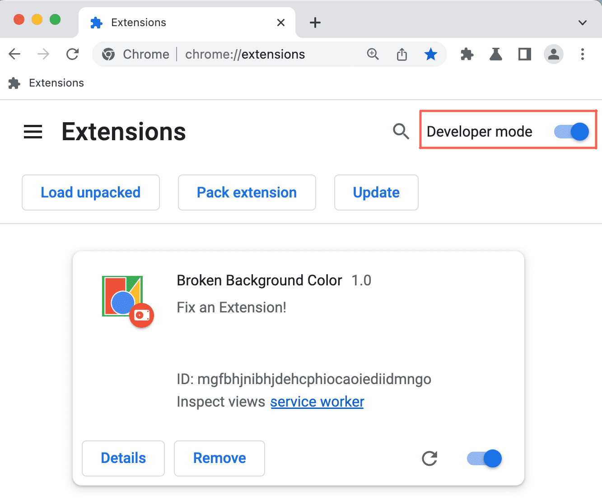
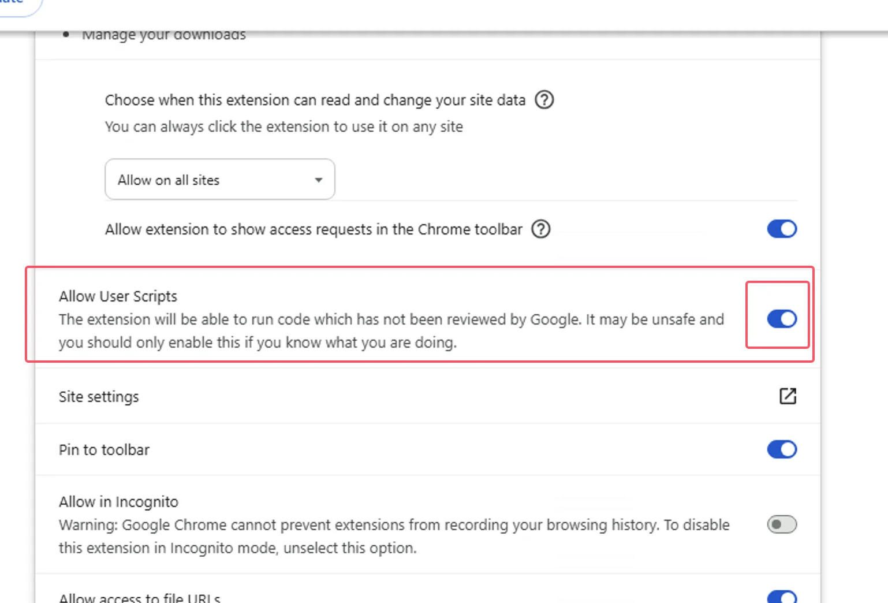

# 🐒 ScriptsMonkey

**ScriptsMonkey** là tập hợp các userscript (.user.js) giúp cải thiện trải nghiệm trên một số trang web. Bạn có thể cài đặt và sử dụng trực tiếp thông qua trình quản lý như Tampermonkey hoặc Violentmonkey.

## 📂 Danh sách Userscript

| 🏷️ Tên Script               | 🔍 Mô tả                                                   | 📖 Chi tiết                                    | 📝 Mã nguồn                                                  | ⚙️ Cài đặt                                                                                                     |
| :-------------------------- | :--------------------------------------------------------- | :--------------------------------------------- | :----------------------------------------------------------- | :------------------------------------------------------------------------------------------------------------- |
| **EOP Helper**              | Hỗ trợ nâng cao khi sử dụng trang web EOP                  | [📖 Chi tiết](./Docs/EOP_Helper.user.js.md)    | [📝 Mã nguồn](./Scripts/EOP_Helper.user.js)                  | [📥 Install](https://github.com/vuquan2005/ScriptsMonkey/raw/main/Scripts/EOP_Helper.user.js)                  |
| **sv.HaUI**                 | Công cụ hỗ trợ cho sinh viên HaUI                          | [📖 Chi tiết](./Docs/svHaUI_Helper.user.js.md) | [📝 Mã nguồn](./Scripts/svHaUI_Helper.user.js)               | [📥 Install](https://github.com/vuquan2005/ScriptsMonkey/raw/main/Scripts/svHaUI_Helper.user.js)               |
| **PTIT Helper**             | Công cụ hỗ trợ cho sinh viên PTIT                          | [📖 Chi tiết](./Docs/svPTIT_Helper.user.js.md) | [📝 Mã nguồn](./Scripts/svPTIT_Helper.user.js)               | [📥 Install](https://github.com/vuquan2005/ScriptsMonkey/raw/main/Scripts/svPTIT_Helper.user.js)               |
| **Block save as**           | Chặn phím tắt `Ctrl + S` lưu trang. Bật CapsLock để bỏ qua | -                                              | [📝 Mã nguồn](./Scripts/Block_save_as_Web.user.js)           | [📥 Install](https://github.com/vuquan2005/ScriptsMonkey/raw/main/Scripts/Block_save_as_Web.user.js)           |
| **Download Captcha svHaUI** | Tự động tải hình ảnh captcha của trang svHaUI              | -                                              | [📝 Mã nguồn](./Scripts/Download_Captcha_svHaUI.user.js)     | [📥 Install](https://github.com/vuquan2005/ScriptsMonkey/raw/main/Scripts/Download_Captcha_svHaUI.user.js)     |
| **Save Multiple Questions** | Lưu lại câu hỏi trắc nghiệm từ qldt.haui.edu.vn            | -                                              | [📝 Mã nguồn](./Scripts/Save_the_multiple_questions.user.js) | [📥 Install](https://github.com/vuquan2005/ScriptsMonkey/raw/main/Scripts/Save_the_multiple_questions.user.js) |

## 🚀 Cài đặt Userscript

Để sử dụng các Userscript từ **ScriptsMonkey**, bạn cần cài đặt tiện ích [Tampermonkey](https://www.tampermonkey.net/) hoặc một số trình quản lý user scripts khác.

### Bước 1: Cài đặt Tampermonkey

1. Truy cập [Tampermonkey](https://www.tampermonkey.net/).
2. Chọn trình duyệt bạn đang sử dụng và làm theo hướng dẫn cài đặt.

   (⚠️Lưu ý quan trọng: Do Google cập nhật Manifest V3 nên cần bật [`Chế độ nhà phát triển`](https://www.tampermonkey.net/faq.php?ext=iikm&version=5.3.3#Q209) và cho phép Tampermonkey chèn scripts theo hướng dẫn dưới đây)
   - **Bật Chế độ nhà phát triển (Developer Mode) trên trình duyệt:**

   - **Cho phép chèn User Scripts trong cài đặt Tampermonkey:**

### Bước 2: Thêm Userscript từ ScriptsMonkey

Có **3 cách** để cài đặt Userscript:

#### ⚡ **Cách 1: Cài đặt nhanh từ GitHub**

1. Truy cập [Danh sách Userscript](#-danh-sách-userscript).
2. Nhấn vào nút **📥 Install** tương ứng với script bạn muốn.
3. Tampermonkey sẽ tự động nhận diện và yêu cầu xác nhận cài đặt.

#### 🔗 **Cách 2: Cài đặt thông qua liên kết Raw**

1. Truy cập vào thư mục [Scripts](./Scripts).
2. Chọn file `.user.js` bạn muốn cài.
3. Nhấn nút **Raw** để mở file ở chế độ thô.
4. Tampermonkey sẽ tự động hiển thị giao diện cài đặt, bạn chỉ cần nhấn **Install**.

#### 👨‍💻 **Cách 3: Copy-Paste thủ công**

1. Mở Tampermonkey → **Create a new script**.
2. Xóa toàn bộ nội dung mặc định.
3. Copy toàn bộ nội dung từ file `.user.js` trên GitHub.
4. Dán vào trình chỉnh sửa của Tampermonkey.
5. Lưu lại bằng cách nhấn **File → Save** hoặc `Ctrl + S`.

## 🛠 Đóng góp

Bạn có thể đóng góp bằng cách:

- Gửi Pull Request với script mới hoặc nâng cấp các script hiện tại
- Mở [Issue](https://github.com/vuquan2005/ScriptsMonkey/issues) để báo lỗi hoặc đề xuất ý tưởng

## 📄 Giấy phép

MIT License © [vuquan2005](https://github.com/vuquan2005)
